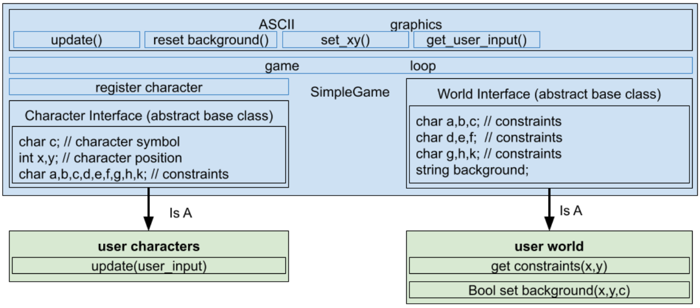

# Purpose

The internet provides a wealth of valuable resources for a student learning object-oriented programming. 
This projected started as a resource guide with the goal of connecting students to on-line resources: https://github.com/egregori3/C-Plus-Plus_Article

Student feedback about the on-line resources indicated a need for better "more interesting" examples. That feedback drove this project.
The code for this project was written to demonstrate various aspects of C++ and OOP, not necassarily to demonstrate best programming practices. In some cases, I know I swayed from best practices in order to demonstrate as many C++ and OOP techniques as possible.
I note these decisions in the comments.
When selecting resources to reference, 

# Introduction

A simple game consists of an ascii graphics based world and characters. There are two types of characters: user controlled and “AI” controlled. The world both constrains the characters and is altered by them. 

* Simple game “has a” characters (composition)

* Simple game “has a” world (composition)

* Simple game “has a” ascii graphics/user interface (composition)

* You define the game using “is a” relationships. You create a class that “is a” world. You create multiple classes that “is a” character. 

Think of the SimpleGame class as a framework with defined interfaces for characters and the world. Your classes inherit from the interfaces to define the world and characters.

# Main()

1. User creates classes and inherits from the character abstract class.The user can have multiple characters. Registers the characters with the SimpleGame class.

2. User creates a class and inherits from the world abstract class. 

3. User calls SimpleGame.loop()

# SimpleGame.loop()

1. Reset background with world.background

2. Call world.get_constraints(character.x, character.y)

3. Copy world.constraints to character.constraints

4. get_user_input()

5. If user_input is exit; exit

6. Call character.update(user_input) - this needs to update x,y and c (the algorithm should use constraints)

7. Call set_background(character.x, character.y, character.c)

8. If set_background() returned true; Call set_xy(character.x, character.y, character.c)

9. Call update()

10. Get next character

11. Goto 2

